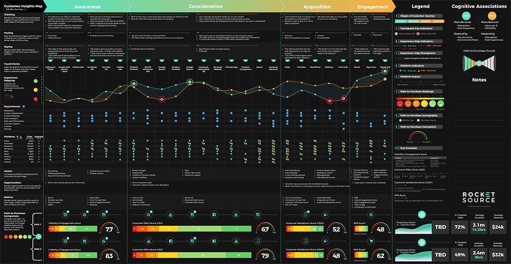

# Max - Q      (maximum dynamic pressure)
R&D of advanced gradient boosting algorithms implemented in artificial neural-networks, as a form of Time-Series execution.
XGBoost is a software library that stands for extreme gradient boosting.  The library is an implementation of gradient boosting machines created by Tianqi Chen as a research project, and since contributed to by other developers.  XGBoost focuses on computational speed and model performance, offering optimization features such as Gradient Boosting, Stochastic Gradient Boosting, and Regularized Gradient Boosting.

  eXtreme Gradient Boosting 
===========

[Community](https://xgboost.ai/community) |
[Documentation](https://xgboost.readthedocs.org) |
[Resources](demo/README.md) |
[Contributors](CONTRIBUTORS.md) |
[Release Notes](NEWS.md)

  

# NOTICE: 
These repositories are a (WIP) work in progress, and not fully-functional without workflow/actions setup and OAuth.

The XGBoost algorithm is implemented to maximize the efficiency of compute time and memory resources.  The algorithm features Sparse Aware implementation by automatically handling missing values from data sets.  Additionally, the algorithm allows for continued training of an already fitted model on new data. 

XGBoost is an optimized distributed gradient boosting library designed to be highly ***efficient***, ***flexible*** and ***portable***.

It initiates machine learning algorithms under the [Gradient Boosting](https://en.wikipedia.org/wiki/Gradient_boosting) framework.
 
 XGBoost provides a parallel tree boosting (also known as GBDT, GBM) that solve many data science problems in a fast and accurate way.
 
 The same code runs on major distributed environment (Kubernetes, Hadoop, SGE, MPI, Dask) and can solve problems beyond billions of examples.

XGBoost is a popular open source software library due mainly to the fact that it is really fast. Compared to other methods of gradient boosting, The Algorithm consistently performs faster than implementations from Python, Spark, and R. 

License
-------
© Contributors, 2019. Licensed under an [Apache-2](https://github.com/dmlc/xgboost/blob/master/LICENSE) license.

  

  

Interactive dashboards are for demo and display ONLY!

# MIT License

Copyright (c) MitchellTesla    2021 MIT LICENSE

Permission is hereby granted, free of charge, to any person obtaining a copy
of this software and associated documentation files (the "Software"), to deal
in the Software without restriction, including without limitation the rights
to use, copy, modify, merge, publish, distribute, sublicense, and/or sell
copies of the Software, and to permit persons to whom the Software is
furnished to do so, subject to the following conditions:

The above copyright notice and this permission notice shall be included in all
copies or substantial portions of the Software.

THE SOFTWARE IS PROVIDED "AS IS", WITHOUT WARRANTY OF ANY KIND, EXPRESS OR
IMPLIED, INCLUDING BUT NOT LIMITED TO THE WARRANTIES OF MERCHANTABILITY,
FITNESS FOR A PARTICULAR PURPOSE AND NONINFRINGEMENT. IN NO EVENT SHALL THE
AUTHORS OR COPYRIGHT HOLDERS BE LIABLE FOR ANY CLAIM, DAMAGES OR OTHER
LIABILITY, WHETHER IN AN ACTION OF CONTRACT, TORT OR OTHERWISE, ARISING FROM,
OUT OF OR IN CONNECTION WITH THE SOFTWARE OR THE USE OR OTHER DEALINGS IN THE
SOFTWARE.
